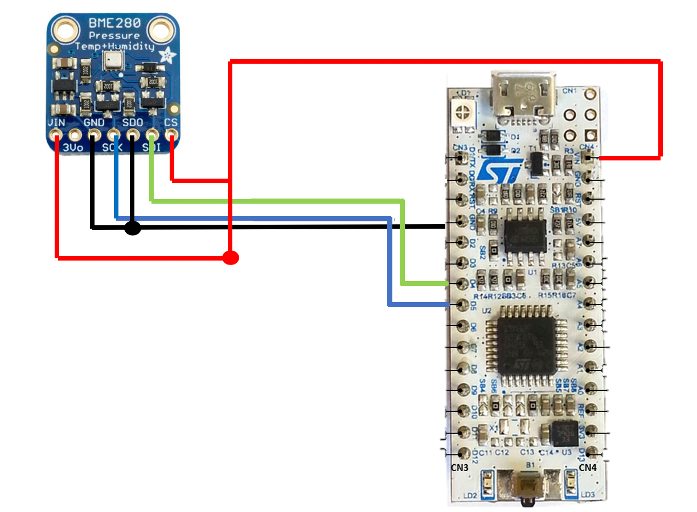
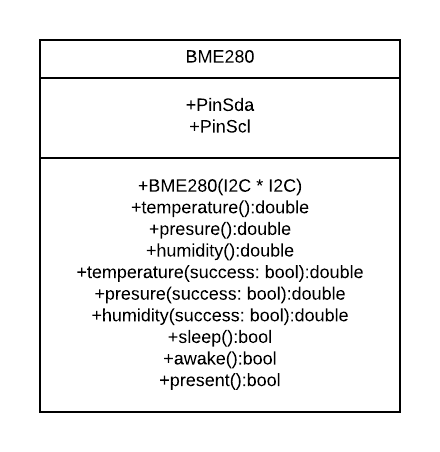

# ParticulaTPH
This is a repository where we put code for the BME280 sensor (TPH)

## BME 280 mbed library
Here we convert the raw register data from the sensor (BME280) to usable variables. We do this by using the I2C bus to transport the data from registery 0XF7 to 0XFE. That we then in turn can do fancy stuff with. 

### Proof of concept
The only thing that is currently added is the posiblility to return the values as doubles instead of floats.

#### Pinout
Connect the folowing leads From the BME 280 sensor:
VDD to a 3V3 powersuply
GND to a comon ground
SDO to Ground
// This selects the Address on the I2C buss To 0X76
CSB to VDD
// This is to set the comunication to I2C
SCK to SCL
SDI to SDA
// SCL and SDA are the chosen I2C pins on the chosen microconrtoller

In the folowing image we are using a Nucleo_F303K8 and a ADAFRUIT_BME280 board.

#### UML
Here you can find all the data and methodes neded for use in the Particula project.
